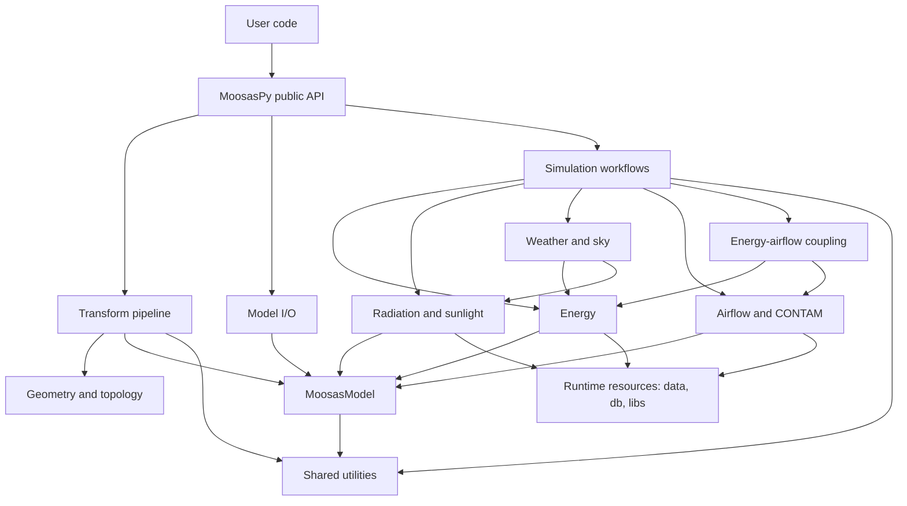

# MoosasPy Documentation

## Overview

MoosasPy is a Python toolkit for building geometry processing and building-performance analysis. It provides geometry transformation, model I/O, weather and sky models, radiation and sunlight calculations, simplified energy analysis, and airflow-network preparation.

This repository is Python-only. It does not contain the previous SketchUp plugin, Ruby sources, or browser UI compatibility layer.

## Architecture



## Requirements and Installation

MoosasPy requires Python 3.10 or newer. Install the package from the repository root:

```bash
python -m pip install .
```

For tests and release tooling, install the development extras:

```bash
python -m pip install -e ".[dev]"
```

Verify the package import:

```bash
python -c "import MoosasPy; print(MoosasPy.__version__)"
```

## Quick Start

Convert a supported geometry file into a structured `MoosasModel`:

```python
from MoosasPy.transform import transform

model = transform("example.obj", stdout=None)
model.save("model.rdf")
```

`transform()` accepts only GEO, OBJ, and STL geometry sources. It constructs a complete model but does not write model files.

## Public API

The top-level `MoosasPy` package has three operational API areas:

| API | Purpose |
| --- | --- |
| `transform` | Transform source geometry into a structured building model. |
| `MoosasModel.load` / `model.save` | Load and save model formats. |
| `simulation` | Access energy, radiation, airflow, weather, and coupled simulation domains. |

```python
from MoosasPy import MoosasModel, simulation, transform

model = transform.transform("example.obj", stdout=None)
energy = simulation.energy.EnergyRunner(model=model).run()
model.save("model.rdf")
restored = MoosasModel.load("model.rdf")
```

Domain-level APIs are accessed from `simulation`, for example
`simulation.radiation.positionRadiation` and `simulation.weather.prepare_epw`.

## Package Layout

| Path | Contents |
| --- | --- |
| `MoosasPy/model/` | `MoosasModel` and its model-file I/O boundary. |
| `MoosasPy/model/io/` | RDF, XML, JSON, IDF, Graph, and gbXML model adapters. |
| `MoosasPy/transform/` | GEO/OBJ/STL transformation pipeline. |
| `MoosasPy/transform/importers/` | Geometry-source readers used only by transform. |
| `MoosasPy/transform/alignment/` | Geometric alignment and coordinate-processing helpers. |
| `MoosasPy/transform/geometry/` | Geometry primitives, topology cleansing, contours, and space generation. |
| `MoosasPy/simulation/airflow/` | Airflow-network and CONTAM project preparation, execution, and iteration. |
| `MoosasPy/simulation/coupling/` | Cross-domain workflows for energy-airflow, energy-radiation, sunlight, and photovoltaic analysis. |
| `MoosasPy/simulation/energy/` | Simplified energy analysis, photovoltaic energy conversion, and thermal-load helpers. |
| `MoosasPy/simulation/radiation/` | Radiation geometry export, ray tests, sunlight, and Radiance daylight workflows. |
| `MoosasPy/simulation/weather/` | Typed weather data, station access, downloads, and explicit EPW preparation. |
| `MoosasPy/simulation/weather/sky/` | Direct-sun geometry and cumulative Tregenza sky models. |
| `MoosasPy/utils/` | Shared paths, constants, errors, date utilities, and support functions. |
| `MoosasPy/data/` | Legacy runtime example data. New test fixtures belong under `test/`. |
| `MoosasPy/db/` | Building templates, material libraries, schedules, weather data, and EnergyPlus resources. |
| `MoosasPy/libs/` | Native executables and resources used by simulation providers. |
| `MoosasPy/__temp__/` | Runtime workspace excluded from distributions. |

## Model I/O

Model-file I/O is exposed by `MoosasModel`:

```python
from MoosasPy import MoosasModel

model = MoosasModel.load("model.xml")
model.save("model.rdf")
model.save("model.idf")
model.save("model.graph.json")
```

GEO, OBJ, and STL must enter through `transform()`. `MoosasModel.load()` accepts RDF/TTL, XML, JSON, and IDF. XML and JSON use a same-named `.geo` companion as an internal sidecar. `model.save()` additionally supports Graph JSON and gbXML.

## Analysis Modules

### Energy

`MoosasPy.simulation.energy.energyAnalysis` performs rapid energy analysis using the native tools under `MoosasPy/libs/energy`. `EnergyRunner` returns structured command diagnostics; `getEnergyInput` and `parseEnergyOutput` remain available for lower-level input and result handling.

### Radiation and Sunlight

`MoosasPy.simulation.radiation` provides `modelRadiation`, `spaceRadiation`, `faceRadiation`, `positionRadiation`, `writeRadGeo`, and `rayTest`. `RadianceRunner` performs isolated Radiance daylight calculations from a model and `RadianceSky`; each run uses a temporary work directory and returns structured daylight metrics and command diagnostics. `positionSunHour` calculates direct sunlight duration from an explicit `DirectSky`-compatible object and either a model or a GEO scene.

### Weather

`MoosasPy.simulation.weather` is organized around immutable `Location` and
`WeatherData` records. `station.py` reads the packaged station catalog and
hourly CSV data; `downloader.py` handles explicit external catalog lookup and
EPW download; `epw.py` converts an EPW into weather, WEA, and cumulative-sky
assets; and `weather.sky` owns both direct-sun geometry and cumulative Tregenza
sky models. EPW-generated assets are written only to a caller-provided output
directory and are returned together as `PreparedWeather`.

```python
from MoosasPy.simulation.weather import load_station_weather, prepare_epw

weather = load_station_weather("545110")
prepared = prepare_epw("custom.epw", "simulation-input/weather")
model.weather = prepared.weather
model.cumSky = prepared.cumulative_skies
```

Energy, radiation, and airflow do not import each other. Cross-domain workflows
load and attach weather through `MoosasPy.simulation.coupling`.

### Ventilation

`MoosasPy.simulation.airflow` provides functions to construct airflow-network and CONTAM project files: `buildPrj`, `buildNetworkFile`, `buildZoneInfoFile`, `iterateFile`, `iterateProjects`, `contam_iteration`, and `sensible_heat_iteration`. `MoosasPy.simulation.coupling.EnergyAirflowCoupler` coordinates cross-domain workflows.

## Runtime Resources

Native execution is separated from domain runners by the `NativeEngine`
protocol, with `SubprocessEngine` as the local default. Energy, Radiance, and
airflow runners use `SimulationWorkspace` for isolated run files and attach a
`WorkspaceReport` to their `SimulationResult`. Temporary workspaces are cleaned
automatically; retained airflow and coupling workspaces remain available for
follow-up processing and diagnostics.

The package expects `libs`, `db`, `data`, and `__temp__` to remain adjacent to the Python modules in an installed distribution. Native executables are platform-specific; validate target-platform support before deploying to a non-Windows environment.

## Testing

Keep tests and fixtures under the repository-level `test/` directory. Example data currently located in `MoosasPy/data` is legacy content and should be moved into the relevant test fixture directory when it is no longer needed at runtime.

Run validation from the repository root:

```bash
python -m pytest -q
```

## Packaging and Release

Package metadata is defined in the repository-level `pyproject.toml`. Build distributions from the repository root:

```bash
python -m build
python -m twine check dist/*
```

The version is derived from tags in the form `moosaspy-vMAJOR.MINOR.PATCH`. The GitHub Actions release workflow builds distributions, checks package metadata, and publishes release assets when such a tag is pushed.
